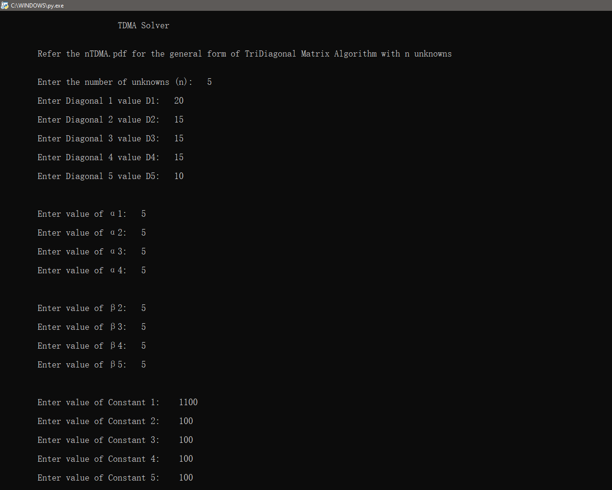
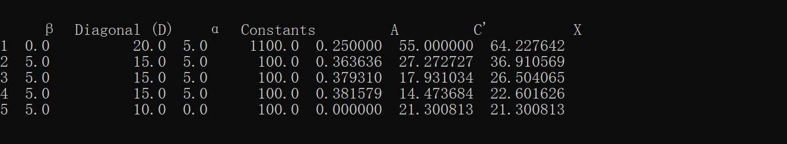
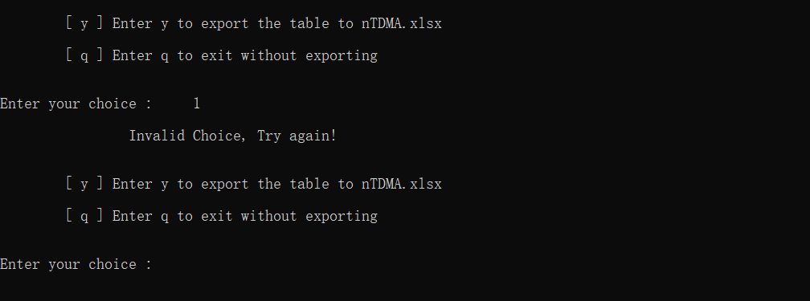
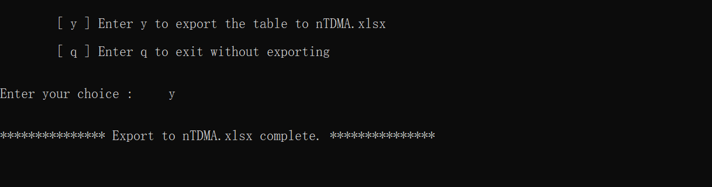
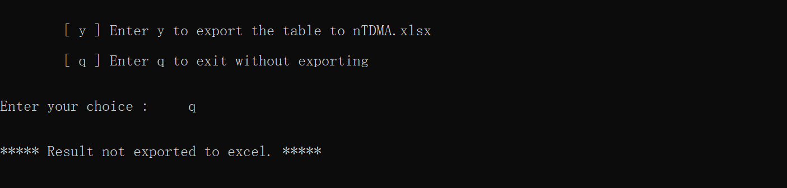

# TDMA-solver
## Python code for Tridiagonal Matrix Algorithm or Thomas Algorithm with n unknowns

Must refer _[nTDMA.pdf](nTDMA.pdf)_ in the repository to get the _general form_ used in the python code.
All the variables used in python code are similar to the general form.
User must input the data as per the general form.
The python code has all the necessary comments to understand the tridiagonal matrix algorithm.

Click on the following link to checkout the video to easily use this python code.

- [YOUTUBE](https://youtu.be/IbjNYqMF_cI)

_**Note** : The TDMA or Thomas algorithm solves any kind of tridiagonal matrices._
At the end of the code input() is used to hold the screen, just press enter to exit the code.

## Motivation
To learn Python programming and use python packages.

## Dependencies
- [Python](https://python.org) 3.9.5

- [Pandas](https://pandas.pydata.org) 1.2.4

- [Openpyxl](https://openpyxl.readthedocs.io) 3.0.7

## Output
User input data :

Solution which is printed in tabular form :

If user input invalid option :

If user input y :

If user input q :

_**Note** : The example showed in [nTDMA.pdf](nTDMA.pdf) was solved manually using the calculator and the appropriate formula by forward and back substitution._

## License

[Apache License 2.0](LICENSE)

## Author

[Yahya Ansari](https://github.com/novus-afk)
